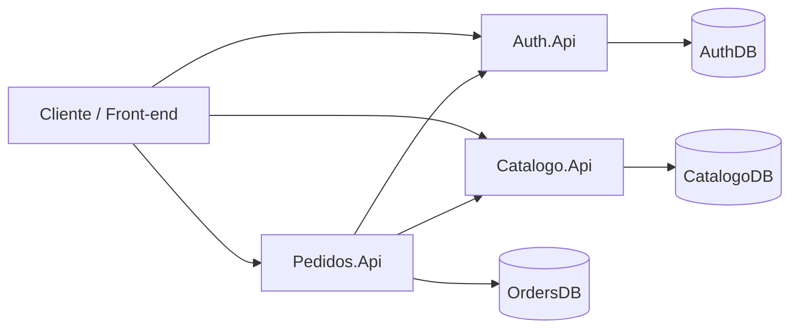

# 🛒 Mini E-commerce com Microsserviços (.NET)

Este projeto tem como objetivo **estudar e aplicar os conceitos fundamentais de microsserviços**, utilizando **.NET 8**, **Docker** e **SQL Server**, de forma prática e progressiva.

A ideia não é criar um sistema grande, mas sim **entender na prática**:
- separação de responsabilidades
- comunicação entre serviços
- isolamento de banco de dados
- problemas reais que surgem ao trabalhar com microsserviços

---

## 🎯 Objetivo do Projeto

- Compreender **quando e por que usar microsserviços**
- Evitar o erro comum de criar um *monólito distribuído*
- Aplicar boas práticas de arquitetura no ecossistema .NET
- Criar um projeto didático e relevante para portfólio

---

## 🧩 Arquitetura

O sistema é composto por **microsserviços independentes**, todos organizados em uma única solution (para fins de estudo).

### Microsserviços atuais:

- **Auth.Api**
  - Gerenciamento de usuários
  - Autenticação
  - Validação de usuários para outros serviços

- **Catalogo.Api** *(em desenvolvimento)*
  - Cadastro e consulta de produtos
  - Preços

- **Pedidos.Api** *(em desenvolvimento)*
  - Criação de pedidos
  - Orquestração entre Auth e Catálogo

> Cada microsserviço:
> - Possui **banco de dados próprio**
> - Não compartilha entidades ou DbContext
> - Se comunica apenas via HTTP

---

## 🛠️ Tecnologias Utilizadas

- **.NET 8**
- **ASP.NET Core Web API**
- **Entity Framework Core**
- **SQL Server**
- **Docker**
- **Docker Compose**
- **Swagger / OpenAPI**
- **Git & GitHub**

---

## 🗄️ Banco de Dados

- Cada microsserviço possui **seu próprio banco**
- Exemplo:
  - `AuthDB`
  - `CatalogoDB`
  - `OrdersDB`

Mesmo utilizando o mesmo container SQL Server, os bancos são **totalmente isolados**, respeitando o conceito de microsserviços.

---

## 🐳 Docker

- SQL Server rodando em container Docker
- Cada API possui seu próprio `Dockerfile`
- Comunicação entre serviços será feita via **rede Docker**
- Futuramente, todo o ambiente será orquestrado com `docker-compose`

---

## 📚 Conceitos Aplicados

- Microsserviços
- Separação de responsabilidades
- Clean Architecture (em nível básico)
- Repository Pattern
- Service Layer
- DTOs para entrada e saída de dados
- Injeção de dependência
- Migrations com Entity Framework Core

---

## 🚧 Status do Projeto

🔄 Em desenvolvimento

### Concluído:
- Estrutura da solution
- Auth.Api
- Banco de dados isolado
- Migrations funcionando
- Endpoints básicos de autenticação

### Próximos passos:
- Implementar Catalogo.Api
- Implementar Pedidos.Api
- Comunicação entre microsserviços
- Docker Compose completo
- Resiliência (timeouts, retries)
- Eventos assíncronos (RabbitMQ - estudo futuro)

---

## 📌 Observação Importante

Este projeto foi desenvolvido **com foco em aprendizado**.  
As decisões arquiteturais seguem boas práticas reais, mas priorizam clareza e didática em vez de complexidade desnecessária.

---

## 👨‍💻 Autor

**Fabrício Suhet**  
Desenvolvedor .NET | Estudante de Arquitetura de Software e Microsserviços

